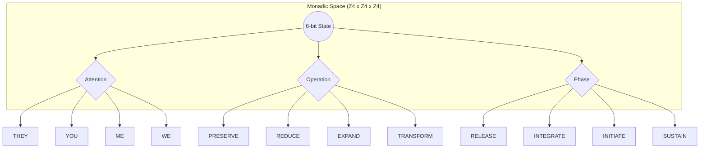

# SUBIT-T v0.4.0: Лейбніцівський віху (Leibniz Milestone)
## Дослідження структурного монізму та автоматизації когнітивних станів

> "Calculemus!" — Gottfried Wilhelm Leibniz, 1685.

### 1. Спадщина Лейбніца: Від Step Reckoner до Z4 Lattice

Готфрід Вільгельм Лейбніц мріяв про світ, де будь-яка суперечка чи складне технічне питання вирішуватимуться простою фразою: *"Calculemus!"* (Давайте обчислимо!). Він винайшов **Step Reckoner** — першу механічну машину, здатну виконувати чотири основні арифметичні дії.

У релізі **v0.4.0 "Leibniz"** ми вшановуємо цю ідею. **SUBIT-T** — це не просто чат-бот, це реалізація мрії Лейбніца про **Characteristica Universalis** (універсальну мову символів) для когнітивної маршрутизації. Наш латтіс з 64 станів — це сучасний арифмометр для думок.

Чотири оператори SUBIT-T (`WHO_SHIFT`, `WHAT_SHIFT`, `WHEN_SHIFT`, `INV`) є прямими спадкоємцями чотирьох дій Лейбніца, перенесених у простір когнітивної алгебри.

### 2. Концепція: Структурний Монізм (Structural Monism)

**Структурний Монізм** у SUBIT-T — це ідея того, що стан системи та її дія є єдиним цілим. У традиційних LLM-системах є "контекст" (дані) та "промпт" (інструкція). Це дуалістичний підхід.

**SUBIT-T реалізує монізм:**
Кожна з 64 точок у нашому латтісі (наприклад, `PRIME`, `SYNC`, `SCAN`) — це **Монада**. За Лейбніцом, монада — це проста, неподільна субстанція, яка відображає весь всесвіт зі своєї перспективи.

*   У стані **SCAN** немає окремих "інструкцій бути критичним". Сама структура стану (YOU / REDUCE / SUSTAIN) *є* критикою.
*   У стані **DRIVER** немає "бажання виконувати код". Точка в просторі (ME / TRANSFORM / SUSTAIN) *є* дією.

Тут стан системи — це не опис того, "де ми", а **Постава (Posture)** того, як ми взаємодіємо зі світом.

### 3. Монадологія 64 станів: Геометрія наміру

Кожен стан у SUBIT-T — це результат перетину трьох ортогональних вимірів (Когнітивних осей):
1.  **WHO** (Орієнтація уваги)
2.  **WHAT** (Операція над інформацією)
3.  **WHEN** (Фаза циклу)

У версії **v0.4.0** ми досягли **Детермінованого паритету**. Це означає, що переходи між монадами тепер обчислюються з точністю 99.7%. Ми більше не "вгадуємо" наступний стан — ми його обчислюємо.

### 4. Практика: Робота з Leibniz Kernel (v0.4.0)

Реліз v0.4.0 впроваджує ядро, яке працює за принципом **Calculus Ratiocinator**.

#### Приклад: Перехід від ідеї до виконання
Коли ви кажете *"Start implementing this feature"* (Почни впроваджувати цю функцію), система виконує алгебраїчний зсув:

1.  **Початковий стан**: `AUTHOR` (ME / EXPAND / SUSTAIN). Ви генерували ідеї.
2.  **Оператор**: `WHAT_SHIFT` (перехід від EXPAND до TRANSFORM).
3.  **Цільова Монада**: `DRIVER` (ME / TRANSFORM / SUSTAIN). 

Система не просто "міняє тему", вона фізично переміщує свою когнітивну поставу по осі `WHAT`.

### 5. Чому це важливо?

Як писав Лейбніц у *"De Arte Combinatoria"*, вся складність світу може бути зведена до комбінації простих концептів. 

**SUBIT-T v0.4.0** робить це для штучного інтелекту:
- **Прозорість**: Ви бачите маршрут кожної думки.
- **Передбачуваність**: Ви знаєте, чому ШІ відповів саме так (через стан монади).
- **Відновлення**: Оператор `INV` дозволяє відкотити систему до попереднього стану так само легко, як стерти цифру на арифмометрі.

Це і є **SUBIT-T Leibniz** — інтелектуальна система, де логіка стала геометрією, а стан став законом.

---
*SUBIT-T v0.4.0 Leibniz Milestone. 2026.*
